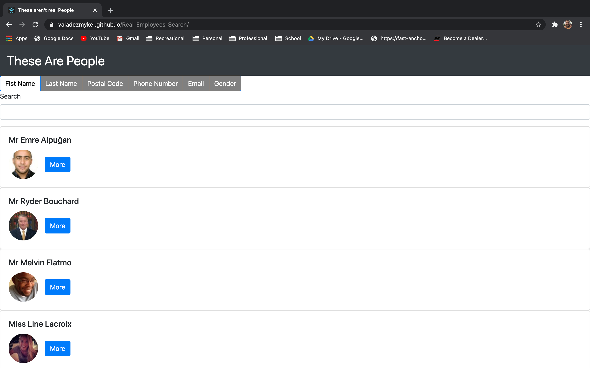

# Real_Employee_Search

## Links 

For the Repository link click [here](https://github.com/valadezMykel/Real_Employees_Search)

For a link to the deployed project click [here](https://valadezmykel.github.io/Real_Employees_Search/)

## Table of Contents

* [About the Project](#about-the-project)
* [Installation](#installation)
* [Usage](#usage)
* [License](#license)
* [Contributors](#contributors)
* [Questions](#questions)

## About the Project

THESE AREN'T REAL PEOPLE.  This project takes randomly generated useres from randomuser.me and applies react state technology to filter through users based on react state hooks. 

## Installation

To use this project you will need a node package manager.  You can fork the repository and clone the repo to your local computer using a git CLI.  Then run "npm install" and allwo the node packages to install.  Set up the react build scripts in the package.json for whatever platform you wish to use.  

## Usage

This project has little practical use as is.  Use this code as a reference to build a react application to set up searches for your react application. 

## License

MIT

## Contributors

Mykel Valadez

## Questions

If you have questions reach out by email at spamaladez@gmail.com